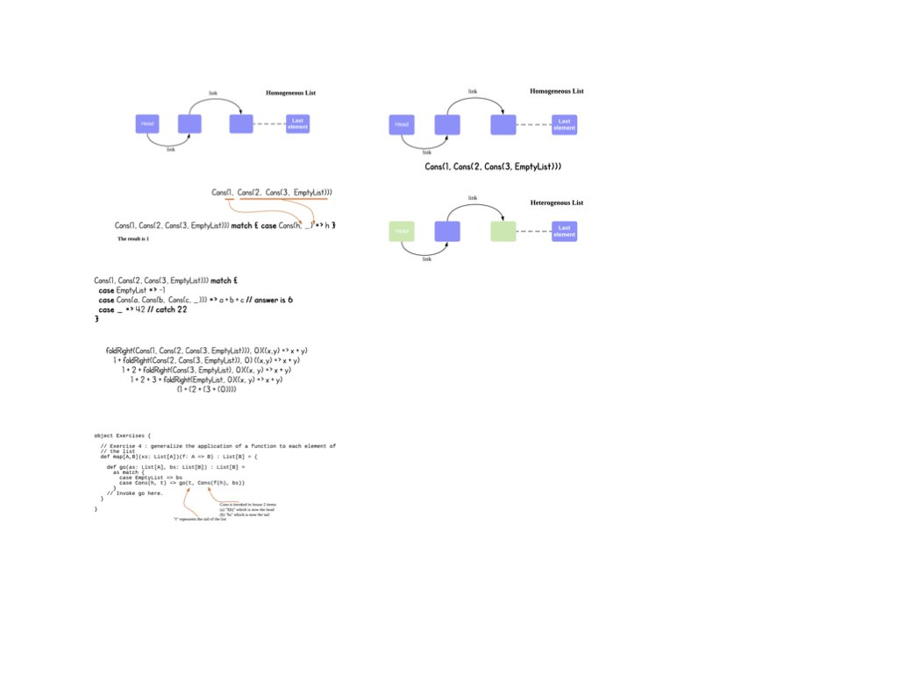

# HandsonFP


This tutorial assumes that you have some prior experience programming in Scala.
This series of exercises might be a little overwhelming for the absolute
beginner but once you have gained some proficiency in Scala, i am positive you
would be able to follow.

## Getting Started

You should be comfortable with the Linux/Unix/WinOS/macOS environment
configuring it. I do not have instructions on how to leverage IDEs, so please
use Google or Stackoverflow for your individual purposes.

To start from the ground up, you basically need the following:
- You would need a Oracle JDK version `1.8` to be installed on your environment.
  - Tested on `JDK8`, `JDK11`, `JDK12` to be working with Scala `2.13.1`
- You would need to install the Scala build tool aka `sbt` from
  [here](https://www.scala-sbt.org/1.x/docs/Setup.html). (**Note:** There're  
  installation instructions on each operating system like macOS, Linux/Unix,
  Win OS.)
- Your favourite editor (i use [neovim](https://neovim.io/)) or IDE.
- You should not have trouble cloning this repository.



### A little about me

I really enjoy Scala, Haskell and have developed some skills in functional
programming. I hope to share with you my passion in functional programming and
hope that you have learnt something from this.

Onward and forward !

## Format of the tutorial

This tutorial is drawn from a few sources of inspiration and its based on the
following approach:
- I present an introduction to each topic in the package to help develop the
  intuition for them.
- Exercises in the package are presented and should be attempted
- Answers revealed 1 week after presentation
- Recurse till we reach the end.

### Table of contents:

The order in which we are going to proceed by working through the following
exercises housed in the following packages:

- gettingstarted
- datastructures
- handlingerrors
- managing _state_; composing _state_ functions
- parallelism and concurrency in Scala
- TBA

Note: All answers to the exercises will be revealed 1 class after each training.

### Property-based Testing

In this repository, you will soon discover that property-based testing (in the
`sbt` console, fire `test` or `sbt test` if you prefer to run directly from the
directory) is implemented which serves two (2) purposes:

- Validating the functionality of your implementation
- Cornerstone for you to leverage on these tests to expand your own learnings

```scala
sbt:Hands-on Functional Programming in Scala> test
[info] Compiling 4 Scala sources to /Users/raymondtay/HandsonFP/answers/target/scala-2.13/test-classes ...
[info] Done compiling.
[info] + Tree.size of trees are at least zero: OK, passed 100 tests.
[info] + Tree.maximum of trees: OK, passed 100 tests.
[info] + Tree.depth of trees: OK, passed 100 tests.
[info] + Tree.`map` of trees: OK, passed 100 tests.
[info] + List.`sum` of ints: OK, passed 100 tests.
[info] + List.`product` of ints: OK, passed 100 tests.
[info] + List.`append` left-/right-identity : OK, passed 100 tests.
[info] + List.`append` general scenarios : OK, passed 100 tests.
[info] + State.`set` will always set its state w/o altering its result: OK, passed 100 tests.
[info] + State.`unit` will always return its pre-defined result: OK, passed 100 tests.
[info] + State.`flatMap` will always chain its state, optionally returning a computation on its results: OK, passed 100 tests.
[info] + State.`modify` will always replace its state, discarding its result.: OK, passed 100 tests.
[info] + State.`map2` will combine two state functions via a binary operation: OK, passed 100 tests.
[info] + State.`map` will always apply its function: OK, passed 100 tests.
[info] + HoF.findFirst - Strings: OK, passed 100 tests.
[info] + HoF.findFirst - Ints: OK, passed 100 tests.
[info] + HoF.isSorted - Ints: OK, passed 100 tests.
[info] + MyTransformation.isSorted for Strings: OK, passed 100 tests.
[info] + MyTransformation.isSorted for Ints: OK, passed 100 tests.
[info] + MyTransformation.isSorted for Double: OK, passed 100 tests.
[info] Passed: Total 20, Failed 0, Errors 0, Passed 20
[success] Total time: 4 s, completed 12 Feb, 2020 8:44:42 AM
```

## References

- Programming in Scala (4th Edition) by Martian Odersky, Lex Spoon, Bill
  Venners
- Functional Programming in Scala by Paul Chiusano, Runar Bjarnason
- Learn You a Haskell for Great Good by Miran Lipovca
- Haskell In Depth by Vitaly Bragilevsky
- Real World Haskell by Bryan O'Sullivan, John Goerzen, Don Stewart
- Parallel and Concurrent Programming in Haskell by Simon Marlow
- Michael Snoyberg's series of Haskell articles on http://www.fpcomplete.com

